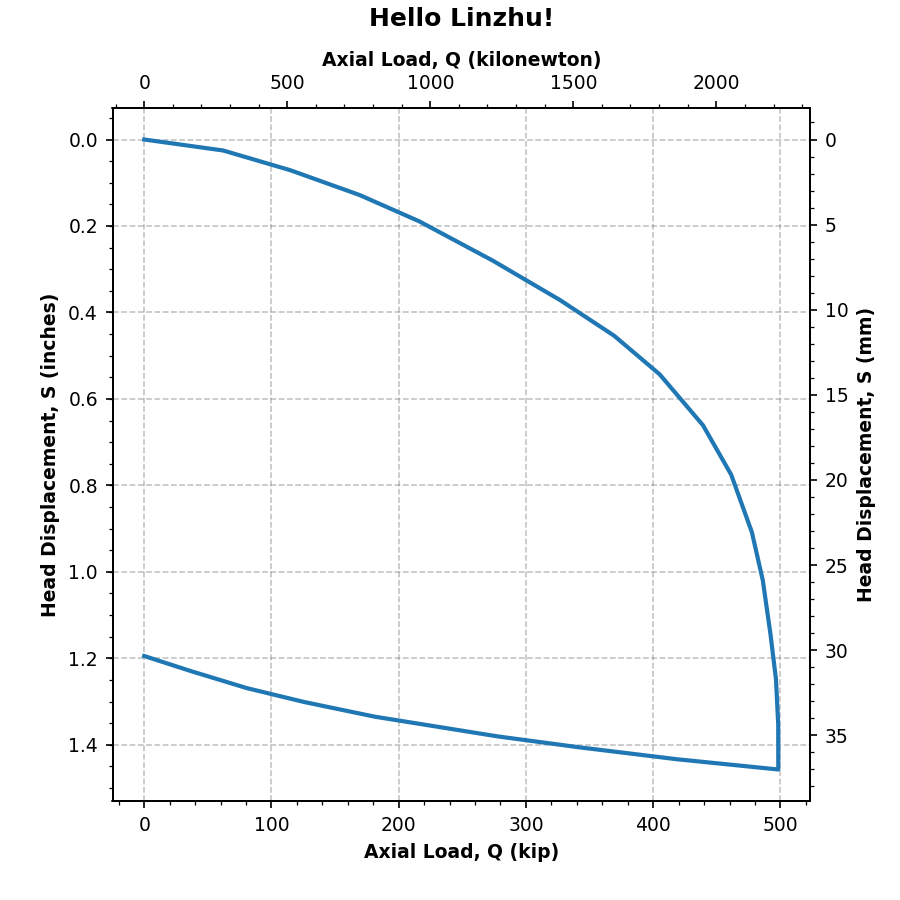

.. _pile-load-tests:

###############
Pile Load Tests
###############

``edafos`` implements the load test interpretation methods presented below. In
order to demonstrate each method, a static load test of a driven H-Pile is
used (:numref:`load-test-example-auto`), taken from Dr. Olson's database.

- HP14X89
- total length: 55 ft (16.76 m)
- exposed length: 1.8 ft (0.55 m)
- width: 14.695 in (37.325 cm)
- AE/L = 1147 kip/in (2009 kN/cm)

.. plot::
   :nofigs:

   from edafos.deepfoundations import Pile, LoadTest

   pile = Pile(unit_system='English',
               pile_type='h-pile',
               shape='HP14X89',
               length=55,
               pen_depth=53.20)

   lt_data = [(0, 0), (62.0902875, 0.025446481), (114.8390789, 0.071056693),
              (169.2957084, 0.128451499), (216.1013052, 0.189185941),
              (273.9797431, 0.280246109), (326.7561297, 0.371289106),
              (369.3233037, 0.453884284), (405.0918308, 0.543187351),
              (439.1770489, 0.661090523), (461.3554368, 0.775588238),
              (477.592674, 0.908575575), (486.1635477, 1.019662112),
              (492.1915722, 1.144201629), (496.5066484, 1.248543074),
              (498.270699, 1.352875934), (498.3340658, 1.45720307),
              (418.387621, 1.433376327), (342.6908415, 1.406198502),
              (278.0495283, 1.380740574), (181.0829594, 1.334981552),
              (125.7902967, 1.301141625), (80.7027585, 1.269018734),
              (37.31181587, 1.230170784), (0, 1.194708257)]

   lt = LoadTest(unit_system='English',
                 name='Static Pile Load Test (Olson LTN 93)',
                 loadtest_type='static',
                 qs_data=lt_data,
                 pile=pile)

   lt.plot(image_name='../_static/figures/load_test_example_auto.png')

.. _load-test-example-auto:

   Load/settlement curve of a statically tested HP14X89 pile (Olson LTN 93).

.. _davisson-criterion:

*********************
Davisson Offset Limit
*********************

The Davisson method, proposed by M. T. Davisson :cite:`Davisson1972-yd`,
determines that the failure load corresponds to an allowable settlement which
occurs a

