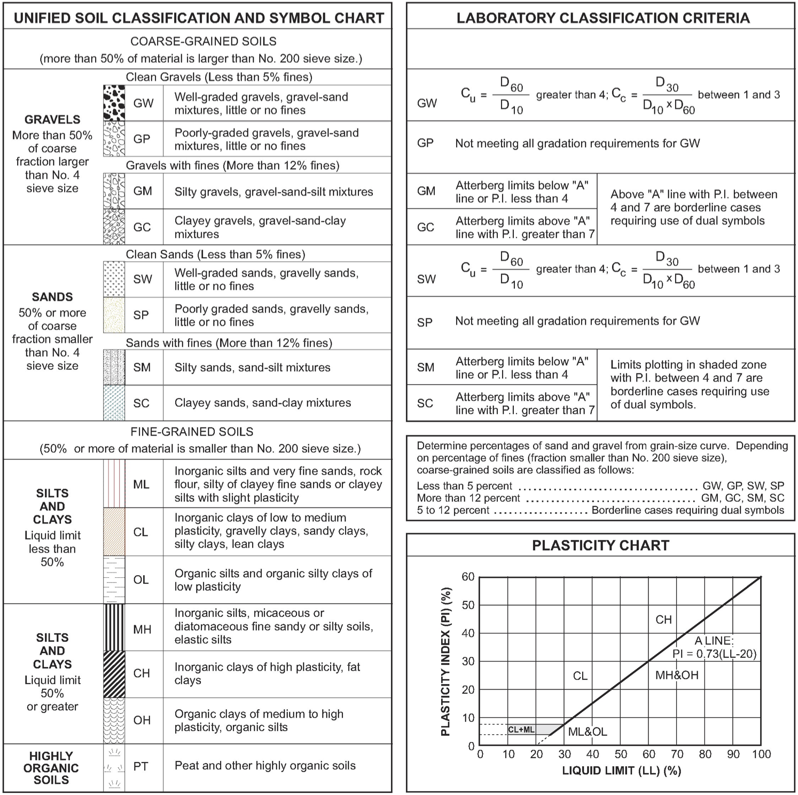

.. _soil-classification:

###################
Soil Classification
###################

.. _uscs-fig:

   Unified Soil Classification System, USCS (adopted from the California
   Department of Transportation, Caltrans).

.. _uscs-table:
.. table:: Unified Soil Classification System (USCS)

   +-------------------+-------------+-----------------------------------------------+-------------------+
   | Soil Type         | USCS Symbol | Long Description                              | Short Description |
   +===================+=============+===============================================+===================+
   | **COARSE-GRAINED SOILS (COHESIONLESS)**                                                             |
   |                                                                                                     |
   | (more than 50% of material is larger than No. 200 sieve size)                                       |
   +-------------------+---------------------------------------------------------------------------------+
   | **GRAVELS**       | **Clean Gravels** (Less than 5% fines)                                          |
   +                   +-------------+-----------------------------------------------+-------------------+
   | More than 50%     | **GW**      | Well-graded gravels, gravel-sand              | Gravel (WG)       |
   | of coarse         |             | mixtures, little or no fines                  |                   |
   + fraction larger   +-------------+-----------------------------------------------+-------------------+
   | than No. 4        | **GP**      | Poorly-graded gravels, gravel-sand            | Gravel (PG)       |
   | sieve size        |             | mixtures, little or no fines                  |                   |
   +                   +-------------+-----------------------------------------------+-------------------+
   |                   | **Gravels with Fines** (More than 12% fines)                                    |
   +                   +-------------+-----------------------------------------------+-------------------+
   |                   | **GM**      | Silty gravels, gravel-sand-silt mixtures      | Silty gravel      |
   +                   +-------------+-----------------------------------------------+-------------------+
   |                   | **GC**      | Clayey gravels, gravel-sand-clay mixtures     | Clayey gravel     |
   +                   +-------------+-----------------------------------------------+-------------------+
   |                   | **Mixed Gravels**                                                               |
   +                   +-------------+-----------------------------------------------+-------------------+
   |                   | **GW-GM**   | Well-graded gravels, gravel-sand              | Gravel (WG,       |
   |                   |             | mixtures, *with* fines                        | w/ fines)         |
   +                   +-------------+-----------------------------------------------+-------------------+
   |                   | **GP-GM**   | Poorly-graded gravels, gravel-sand            | Gravel (PG,       |
   |                   |             | mixtures, *with* fines                        | w/ fines)         |
   +-------------------+-------------+-----------------------------------------------+-------------------+
   | **SANDS**         | **Clean Sands** (Less than 5% fines)                                            |
   +                   +-------------+-----------------------------------------------+-------------------+
   | 50% or more       | **SW**      | Well-graded sands, gravelly sands,            | Sand (WG)         |
   | of coarse         |             | little or no fines                            |                   |
   + fraction smaller  +-------------+-----------------------------------------------+-------------------+
   | than No. 4        | **SP**      | Poorly-graded sands, gravelly sands,          | Sand (PG)         |
   | sieve size        |             | little or no fines                            |                   |
   +                   +-------------+-----------------------------------------------+-------------------+
   |                   | **Sands with Fines** (More than 12% fines)                                      |
   +                   +-------------+-----------------------------------------------+-------------------+
   |                   | **SM**      | Silty sands, sand-silt mixtures               | Silty sand        |
   +                   +-------------+-----------------------------------------------+-------------------+
   |                   | **SC**      | Clayey sands, sand-clay mixtures              | Clayey sand       |
   +                   +-------------+-----------------------------------------------+-------------------+
   |                   | **Mixed Sands**                                                                 |
   +                   +-------------+-----------------------------------------------+-------------------+
   |                   | **SW-SM**   | Well-graded sands, gravelly sands,            | Sand (WG,         |
   |                   |             | *with* silt                                   | w/ silt)          |
   +                   +-------------+-----------------------------------------------+-------------------+
   |                   | **SW-SC**   | Well-graded sands, gravelly sands,            | Sand (WG,         |
   |                   |             | *with* clay                                   | w/ clay)          |
   +                   +-------------+-----------------------------------------------+-------------------+
   |                   | **SP-SM**   | Poorly-graded sands, gravelly sands,          | Sand (PG,         |
   |                   |             | *with* silt                                   | w/ silt)          |
   +                   +-------------+-----------------------------------------------+-------------------+
   |                   | **SP-SC**   | Poorly-graded sands, gravelly sands,          | Sand (PG,         |
   |                   |             | *with* clay                                   | w/ clay)          |
   +-------------------+-------------+-----------------------------------------------+-------------------+
   | **FINE-GRAINED SOILS (COHESIVE)**                                                                   |
   |                                                                                                     |
   | (50% or more of material is smaller than No. 200 sieve size)                                        |
   +-------------------+-------------+-----------------------------------------------+-------------------+
   | **SILTS AND       | **ML**      | Inorganic silts and very fine sands, rock     | Sandy/Clayey      |
   | CLAYS**           |             | flour, silty of clayey fine sands or clayey   | Silt (LP)         |
   |                   |             | silts with slight plasticity                  |                   |
   + Liquid limit      +-------------+-----------------------------------------------+-------------------+
   | less than 50%     | **CL**      | Inorganic clays of low to medium plasticity,  | Clay (LP)         |
   |                   |             | gravelly clays, sandy clays, silty clays,     |                   |
   |                   |             | lean clays                                    |                   |
   +                   +-------------+-----------------------------------------------+-------------------+
   |                   | **OL**      | Organic silts and organic silty clays of      | Organic           |
   |                   |             | low plasticity                                | silt/clay (LP)    |
   +                   +-------------+-----------------------------------------------+-------------------+
   |                   | **CL-ML**   |                                               | Silty Clay (LP)   |
   +                   +-------------+-----------------------------------------------+-------------------+
   |                   | **SM-ML**   |                                               | Sandy/Clayey      |
   |                   |             |                                               | Silt (LP)         |
   +-------------------+-------------+-----------------------------------------------+-------------------+
   | **SILTS AND       | **MH**      | Inorganic silts, micaceous or diatomaceous    | Sandy/Clayey      |
   | CLAYS**           |             | fine sandy or silty soils, elastic silts      | Silt (HP)         |
   +                   +-------------+-----------------------------------------------+-------------------+
   | Liquid limit      | **CH**      | Inorganic clays of high plasticity, fat clays | Clay (HP)         |
   + 50% or greater    +-------------+-----------------------------------------------+-------------------+
   |                   | **OH**      | Organic clays of medium to high plasticity,   | Organic           |
   |                   |             | organic silts                                 | silt/clay (HP)    |
   +                   +-------------+-----------------------------------------------+-------------------+
   |                   | **OL-OH**   |                                               |                   |
   +                   +-------------+-----------------------------------------------+-------------------+
   |                   | **CL-CH**   |                                               |                   |
   +-------------------+-------------+-----------------------------------------------+-------------------+
   | **HIGHLY ORGANIC  | **PT**      | Peat and other highly organic soils           | Peat              |
   | SOILS**           |             |                                               |                   |
   +-------------------+-------------+-----------------------------------------------+-------------------+
   | **ROCKS**                                                                                           |
   |                                                                                                     |
   | (not in USCS)                                                                                       |
   +-------------------+-------------+-----------------------------------------------+-------------------+
   |                   | **ROCK**    |                                               | Rock              |
   +-------------------+-------------+-----------------------------------------------+-------------------+

The USCS table is stored in and can be retrieved from the ``uscs_dict``
dictionary. An example is shown below.

.. ipython:: python

   # Import the `uscs_dict` dictionary
   from edafos.data import uscs_dict

   # Query the `uscs_dict` dictionary
   uscs_dict['GP']['long_desc']

   uscs_dict['GP']['soil_type']

