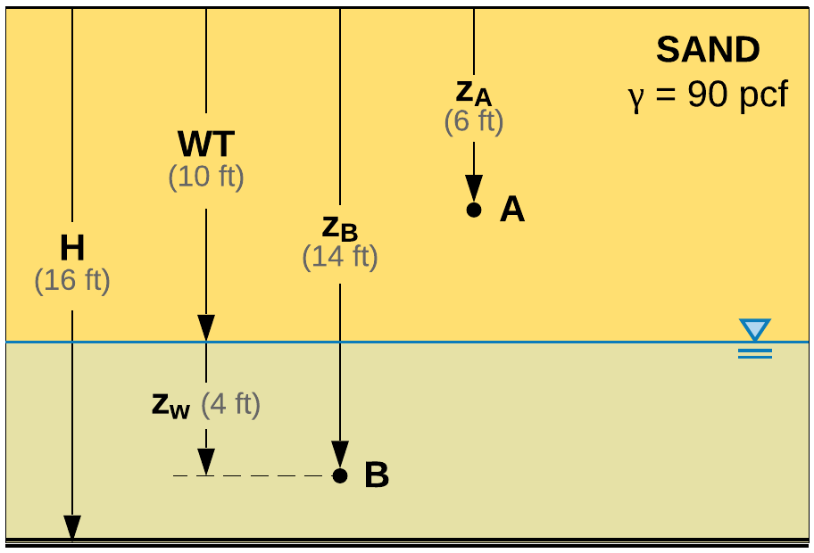

.. _soil-stresses:

#############
Soil Stresses
#############

Calculation of soil stresses (total, porewater, effective) are implemented in
the :meth:`~edafos.soil.profile.SoilProfile.calculate_stress` method. This
section outlines the approach in creating a method that covers most cases
(multiple layers, varying water table) and allows to calculate stresses at any
vertical depth of interest, :math:`z`.

For more on soil stresses refer to the excellent book by `Reese et al. (2006)`_.

.. _Reese et al. (2006): https://www.wiley.com/en-us/Analysis+and+Design+of+Shallow+and+Deep+Foundations-p-9780471431596

.. note::

   For all cases presented below, positive (+) is upwards and reference (0)
   is at ground level.

.. rubric:: Case A - single layer, stresses above and below water table

Consider the soil profile in :numref:`soilstresses_caseA`. A 16-ft sand layer
with total unit weight of 90 lbf/ft\ :sup:`3` and the water table at a depth
of 10-ft. Point A is at depth, :math:`z`, of 6-ft and point B is at a depth,
:math:`z`, of 14-ft below ground level.

.. _soilstresses_caseA:

   Single layer, stresses above and below water table.

The first takeaway comes with the introduction of the term :math:`z_w`, the
vertical distance below the water table.

.. admonition:: Takeaway No 1

   .. math::

      z_w = z - WT

   Always calculate :math:`z_w` and if negative, set :math:`z_w=0`. Hence:

   .. math::

      z_w = \begin{cases}
      0 & \textrm{if } z_w < 0 \\
      z - WT & \textrm{otherwise}
      \end{cases}

**Total stress** at point A:

.. math::

   \sigma_A = \gamma z_A = (90 \textrm{ pcf})(6 \textrm{ ft}) = 540 \textrm{ psf}

**Pore water pressure** at point A:

.. math::

   z_w = z_A - WT = 6 - 10 = -4 \textrm{ ft} = 0

.. math::

   u_A = z_w \, \gamma_w = 0 \textrm{ psf}

**Effective stress** at point A:

.. math::

   \sigma'_A = \sigma_A - u_A = 540 - 0 = 540 \textrm{ psf}

**Total stress** at point B:

.. math::

   \sigma_B = \gamma z_B = (90 \textrm{ pcf})(14 \textrm{ ft}) = 1260 \textrm{ psf}

**Pore water pressure** at point B:

.. math::

   z_w = z_B - WT = 14 - 10 = 4 \textrm{ ft}

.. math::

   u_A = z_w \, \gamma_w = (62.4 \textrm{ pcf})(4 \textrm{ ft}) = 249.6 \textrm{ psf}

**Effective stress** at point B:

.. math::

   \sigma'_B = \sigma_B - u_B = 1260 - 249.6 = 1010.4 \textrm{ psf}

The same example could be implemented in ``edafos`` as follows.

.. ipython:: python

   # Import the `SoilProfile` class
   from edafos.soil import SoilProfile

   # Create a SoilProfile object with initial parameters
   caseA = SoilProfile(unit_system='English', water_table=10)

   # Add the layer properties
   caseA.add_layer(soil_type='cohesionless', height=16, tuw=90)

   print(caseA.layers[['Depth','Height','TUW']])

   # Effective stress at point A
   print(caseA.calculate_stress(6))

   # Effective stress at point B
   print(caseA.calculate_stress(14))
